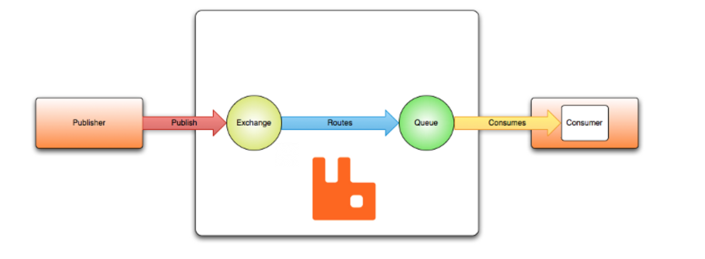

# AMQP

message brokers 从发布者（发布消息，也被成为生产者）接收消息，路由这些消息到消费者（处理消息）。

## 简化的 AMQP 0-9-1 模型

AMQP 0-9-1 有以下观点：消息发布到交换器（经常和办公室或者邮箱对比）。交换器使用成为绑定的规则分发消息的副本给队列。
然后 broker 发送消息到已订阅队列的消费者。或者消费从队列请求抓取/拉取消息。

发布者发布消息的时候，可能指定不同的消息属性（消息元数据），这些元数据可能被broker 使用。
但是，其余部分对 broker 完全不透明，仅由接收消息的应用程序使用。
由于网络不可靠或者应用处理消息可能失败，所以AMQP 0-9-1 模型有消息确认的概念。
一条消息被发送给消费者，消费者通知broker。这个过程可以是自动的，也可以由开发者选择怎样处理。
使用消息确认的时候，如果broker收到了一个确认，就会移除这条消息。（或者一组消息）。

在某些场景下，如果一个消息不能被路由，消息可能返回到发布者，丢失，如果 broker 实现了一个扩展，放入一个被称为死信队列的地方。
发布者通过发布消息时携带的某些参数选择怎样处理这种情况。

队列，交换器和绑定统称为 AMQP 实体。
## AMQP 0-9-1 是可编程的协议

AMQP 的实体和路由模式主要由应用程序来定义，而不是broker。
这给开发者提供了很大的自由度，也要求他们意识到存在的潜在的冲突。
实践上来说，这种情况很少发生，通常都是配置错误。
应用声明他们需要的AMQP实体，定义必要的路由模式，也可以选择删除不用的AMQP实体。

## 交换器和交换类型

交换器是消息发送的 AMQP 实体。交换器拿到实体后会路由到零个或者多个队列。
路由算法依赖于交换器类型和绑定规则，AMQP提供了四种交换器类型。

- 直接交换器
- 扇出交换器
- 话题交换器
- 头部交换器

除了交换器类型，交换器还有很多属性，最重要的几个：

- 名字
- 持久性
- 自动删除（交换器会被删除，如果最后一个队列取消了绑定）
- 参数

交换器可以持久化或者临时的。持久化的交换器重启后仍然存在，而临时的不存在。
不是所有的场景和用例都要求交换器的持久化。

## 默认交换器

这是一个由broker声明的没有名字（空字符串）的直接交换器。
它有一个特别的属性就是每一个创建的队列都会自动的绑定，并且有一个和队列名称相同的路由键。
如果你创建了一个队列名字是hello，AMQP就会绑定它到默认的交换器，路由键就是hello。然后，当你用路由键hello发布消息到默认的交换器，就会发布到hello队列。这就好像直接发布消息到hello队列。

## 直接交换器

直接交换器通过路由键发布消息到队列。
直接交换器是单播路由的理想选择。尽管也可以用于多播路由。
下面是原理说明：

- 队列用路由键 key_name 绑定到交换器
- 当一个携带路由key的新的消息到达这个交换器，如果路由key和绑定的路由key相等，消息就会发送到这个绑定的队列。

直接交换通常用于轮询的方式给多个wokers 分配任务。
需要注意的是，根据AMQP，消息在消费者上进行负载均衡，而不是队列。

用图表示：

## 扇出交换器

一个扇出交换器会路由消息到所有绑定的队列，并且会忽略路由键。
如果有N个队列绑定到了这个扇出交换器，当一个新的消息被发布到这个交换器，消息的一个副本会被发布到所有的队列。
扇出交换非常适合消息的广播路由。

由于扇出交换器发布消息副本到每个绑定的队列，它的使用场景也是相似的。

- 大型多人在线（MMO）游戏可以将其用于排行榜更新或其他全局事件
- 体育新闻网站可以使用扇出交换以近乎实时的方式向移动客户端分发得分更新
- 分布式系统可以广播各种状态和配置更新
- 群组聊天可以使用扇出交换在参与者之间分发消息（尽管AMQP没有内置的在线状态概念，因此XMPP可能是更好的选择）

## 主题交换器

主题交换器基于匹配路由消息到一个或多个队列。
常用于实现各种发布/订阅模式的变体，也可用于消息的多播路由。
主题交换器有非常广泛的使用场景。无论什么时候，
涉及到多个消费者或者多个应用选择他们想要接收的消息，就应该考虑主题交换器。

- 分发与特定地理位置有关的数据，例如销售点。
- 多个 workers 处理的后台任务，每个worker 都可以处理特定的工作集
- 股票价格更新（或者更新其他的财务数据）
- 涉及分类或标记的新闻更新（例如，仅针对特定运动或团队）
- 云中各种服务的编排
- 分布式体系结构/特定于操作系统的软件构建或打包，其中每个构建器只能处理一个体系结构或OS

## 头部交换器

标头交换旨在用于在多个属性上路由，这些属性比路由键更容易表示为消息标头。
x-* 开头的header不会被用来计算匹配性。

## 队列

### 队列名称
### 队列耐用性
### 绑定
## 消费者
## 消息确认
## 拒绝消息
## 负面确认
## 预取消息
## 消息属性和载荷
## 消息确认
## AQMP方法
### 连接
### channel
### 虚拟主机
## AQMP 是可扩展的